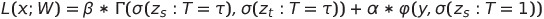
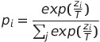

# Distillation
Pytorch implementation of basic Knowledge Distillation (KD) method.
This repository is a simple reference, mainly focuses on basic knowledge distillation/transfer method. I Hope it is useful for your basic understanding / project or research.
 
Distillation is a compression technique in which a compact - smaller model (the student)  is trained to reproduce the behaviour of a cumbersome model (the teacher). This process
could be achieved by transferring the teacher model´s knowledge to the student by minimizing a loss function composed of two components. The first component has as target the distribution of class probabilities logits predicted by the teacher model, also denominated in the literature as soft labels. The second component has as target the ground truth labels, also known as hard labels.

   

Where x is the input, W are the student model parameters, y is the ground truth label, σ is the softmax function , and α and β are coefficients. Gamma is the similitud measure between softmaxs functions parameterized by the temperature T, varphi is the cross-entropy loss function, zs and zt are the logits of the student and teacher respectively.
 
 
The teacher probability distribution in some occasions is sparse, this means the correct class has a very high probability, making it difficult to absorb knowledge from this distribution, and thus it doesn't provide much information beyond the ground truth labels. To overcome this difficulty Hinton et al., 2015 introduced the concept of "softmax temperature".
 

   

 
The following illustration taken from [Distiller doc](https://intellabs.github.io/distiller/knowledge_distillation.html) helps to understand in a better way the multiple loss function components.
 

   

## Experiments
 
To see how distillation works it was taken a DNN ResNet50 (23'512.130 parameters and 94.4 mb) trained on imageNet and fine tuned on [hymenoptera dataset](https://download.pytorch.org/tutorial/hymenoptera_data.zip) for 25 epochs with batch size 32, lr 0.001, momentum 0.9 and lr_scheduler (step size 7 and gamma 0.1). This model is referenced as the teacher (cumbersome). To distill knowledge from the teacher it was taken a smaller model RestNet18 (11'177.538 parameters and 44.8 mb). This means a reduction approximately of 2x parameters and weight size. It was used mean square error (mse) with the logits distributions from both teacher and student as similarity metric, also for simplicity the hyperparameter beta was set to beta = 1 - alpha:
 

The hyperparameter alpha was explored with the values [0.0, 0.5, 1.0]. We ran 4 experiments for each alpha value with the same training configurations used during the teacher's fine tuning. It is recommended to initialize the student model with the parameters from the teacher weights for stability purposes. In our case the student model was previously trained on imageNet, we took those weights as the initial start.
 
## Results
 
The results from the experiments can be seen in the table below.
 
|   alpha   | epoch_loss_l             | epoch_acc_l            | epoch_acc_teacher_l  | diff_t_s              |
|:---------:|:------------------------:|:----------------------:|:--------------------:|:---------------------:|
|    0      |   1.481328 +/- 0.585938  | 0.945359  +/- 0.028460 | 0.934641 +/-  0.0    | 0.964709 +/- 0.226756 |
|    0.5    |   0.823943 +/- 0.292539  | 0.946863  +/- 0.018432 | 0.934641  +/- 0.0    | 0.957835 +/- 0.192383 |
|    1      |   0.225731 +/- 0.090253  | 0.941242  +/- 0.058033 | 0.934641  +/- 0.0    | 1.337674 +/- 0.274519 |

When using alpha equal to 1.0 (just cross entropy) the loss function is more stable than when it is used alpha equal to 0 (just mse). In the last case the process takes approximately 5 epochs to stabilize its values during our experiments. An intermediated value for alpha is to use a value equal to 0.5 which means a weight average of cross entropy and mse. As it can be seen in the illustration the process is equilibrated and allows convergence.

When using alpha equal to 1.0 (just cross entropy) accuracy values begin increasing from as low as 0.7, eventually it converges to 0.94. This value of alpha has a higher risk of convergence than when using 0.0, 0.5 values. Since it was seen the loss function decreases in a stable manner it is preferred to use alpha equal to 0.5.

The difference between teacher and student logits when using alpha equal to 0.0 and 0.5 evolves in a similar manner, this means the optimization process is behaving as expected. On the contrary, the case happens when alpha equals 1.0. The illustration shows there is no an involuntary process to mimic the teacher logits. Also can be inferred from this the parameter distribution explores other regions bringing different local parameter minima.
 

