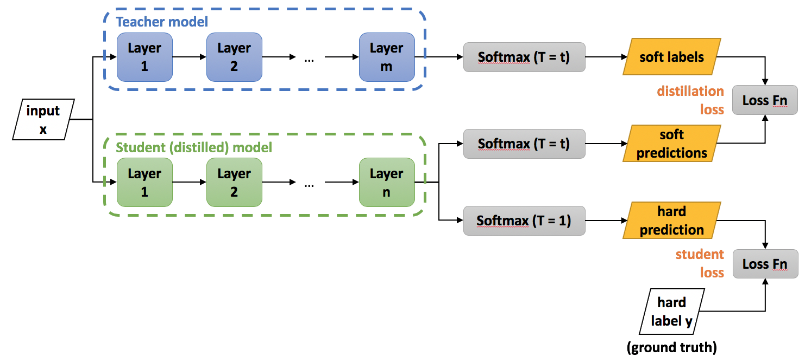
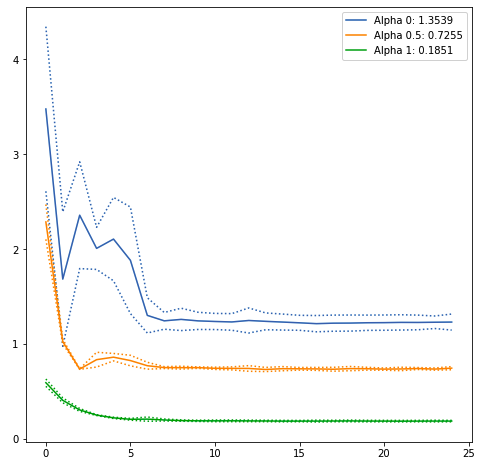

# Distillation
Pytorch implementation of basic Knowledge Distillation (KD) method.
This repository mainly focuses on basic knowledge distillation/transfer method. I hope it is useful for your basic understanding / project or research.
 
Distillation is a compression technique in which a compact - smaller model (the student) is trained to reproduce the behaviour of a cumbersome model (the teacher). This is achieved by transferring the teacher model´s dark knowledge to the student by minimizing a loss function composed of [two components](https://intellabs.github.io/distiller/knowledge_distillation.html). The first component has as target the distribution of class probabilities logits predicted by the teacher model, also denominated in the literature as soft labels. The second component has as target the ground truth labels, also known as hard labels.

 
The teacher probability distribution in some occasions is sparse, this means the correct class has a very high probability, making it difficult to absorb knowledge from this distribution, and thus it does not provide much information beyond the ground truth labels. To overcome this difficulty [Hinton et al., 2015](https://arxiv.org/abs/1503.02531) introduced the concept of "softmax temperature".
 

The following illustration taken from [Distiller doc](https://intellabs.github.io/distiller/knowledge_distillation.html) helps to understand in a better way the multiple loss function components.
 
<p class="aligncenter">
   
</p>


## Experiments
 
To access distillation understanding, it was taken a DNN ResNet50 (23'512.130 parameters and 94.4 mb) trained on imageNet. This model is referenced as the teacher (cumbersome) and was fine tuned on [hymenoptera dataset](https://download.pytorch.org/tutorial/hymenoptera_data.zip) for 25 epochs with batch size 32, lr 0.001, momentum 0.9 and lr_scheduler (step size 7 and gamma 0.1).

An important element during distillation procedure is to adecuate the right initialization for the student´s model in order to converge. [Sanh et al., 2020](https://arxiv.org/abs/1910.01108) recommends to do this procedure by taking as base the teacher weights and remove layers off. In our case the student model was RestNet18 (11'177.538 parameters and 44.8 mb) previously trained on imageNet, we took those weights as the initial start. Comparing the teacher and student models we have a reduction approximately of 2x parameters and weight size.

The hyperparameter alpha was explored with the values [0.0, 0.5, 1.0]. We ran 4 experiments for each alpha value with the same training configurations used during the teacher's fine tuning.
 
## Results
 
The EDA from the experiments were constructed using this [colab notebook](https://colab.research.google.com/drive/1WiMfSUKmDWjUHztqiKEoYMtnAekxJb4U#scrollTo=PDsURUy4K1tW). The table below summarizes the experiments results.
 
|   alpha   | epoch_loss_l             | epoch_acc_l            | epoch_acc_teacher_l  | diff_t_s              |
|:---------:|:------------------------:|:----------------------:|:--------------------:|:---------------------:|
|    0      |   1.481328 +/- 0.585938  | 0.945359  +/- 0.028460 | 0.934641 +/-  0.0    | 0.964709 +/- 0.226756 |
|    0.5    |   0.823943 +/- 0.292539  | 0.946863  +/- 0.018432 | 0.934641  +/- 0.0    | 0.957835 +/- 0.192383 |
|    1      |   0.225731 +/- 0.090253  | 0.941242  +/- 0.058033 | 0.934641  +/- 0.0    | 1.337674 +/- 0.274519 |

When using alpha equal to 1.0 (just cross entropy) the loss function is more stable than when it is used alpha equal to 0 (just mse). In the last case the process takes approximately 5 epochs to stabilize its values during our experiments. An intermediated value for alpha is to use a value equal to 0.5 which means a weight average of cross entropy and mse. As it can be seen in the illustration the process is equilibrated and allows convergence.

Loss             |  Loss last 15 epochs
:-------------------------:|:-------------------------:
  |  


When using alpha equal to 1.0 (just cross entropy) accuracy values begin increasing from as low as 0.7, eventually it converges to 0.94. This value of alpha has a higher risk of convergence than when using 0.0, 0.5 values. Since it was seen the loss function decreases in a stable manner it is preferred to use alpha equal to 0.5.

Accuracy             |  Accuracy last 15 epochs
:-------------------------:|:-------------------------:
  |  


The difference between teacher and student logits when using alpha equal to 0.0 and 0.5 evolves in a similar manner, this means the optimization process is behaving as expected. On the contrary, the case happens when alpha equals 1.0. The illustration shows there is no an involuntary process to mimic the teacher logits. Also can be inferred from this the parameter distribution explores other regions bringing different local parameter minima.
 
Teacher-Student logits             |  Teacher-Student logits  last 15 epochs
:-------------------------:|:-------------------------:
  |  

## Conclusions
When using knowledge distillation it is recommended to use a combination of cross entropy loss and similarity metric for the following reasons:
* Stabilize the loss function optimization process
* Helps the student preventing divergence

**Note**: For this experiment there is not a clear difference in the accuracy metric when using distillation vs no using it, this could happen since the general classification problem is basic. In addition no cross validation in the validation dataset was done. [Hinton et al., 2015](https://arxiv.org/abs/1503.02531) mentions by using ditillation the smaler models learns to generilize as well as the bigger model aspect that can be lost if it is just used the smaller model and trained alone without dark knowledge injection.

## Execution
In order to run distillation process with the experiments configuration run:

````cmd
python multiple_exp.py --alpha 0.5 \
                        --n_exp 4 \
                        --data_dir data/hymenoptera_data \
                        --teacher_file models/resnet50_bees.pt \
                        --num_epochs 25 \
                        --batch_size 32 \
                        --lr 0.001 \
                        --momentum 0.9 \
                        --s_lr_step_size 7 \
                        --s_rl_gamma 0
````

Also this [colab notebook](https://colab.research.google.com/drive/1pSplcCP4bUnW9lvT9gQO5SJXgOM3hdTn#scrollTo=jHuTYXoRCSeG) helps you reproduce the experiments